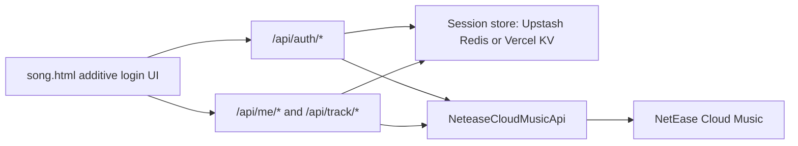

# NetEase Login Backend Design

## Goal

Add real NetEase Cloud Music login to EchoRoom while preserving the current player page layout exactly. The only visible layout additions are a top-center login/account control aligned with the existing top-left VIP button row and top-right reactive button row, plus a matching login modal when the user starts login.

## Non-Negotiable UI Constraint

The existing front-end layout is frozen. Implementation must not move, resize, restyle, or reflow the current `EchoRoom` title, album carousel, central cover, side covers, song title, playback controls, VIP button, reactive toggle, bottom-right add button, background, lyrics layout, or mobile/desktop positioning. Login UI is additive only:

- A compact top-center button at the same vertical height as the top-left star/VIP control and top-right reactive control.
- Before login the button label is `登录网易云`.
- After login the button label becomes the authenticated NetEase nickname.
- Clicking the button opens a modal matching the existing dark cream/yellow visual language.

## Feasibility

This is feasible if the system only plays content the authenticated NetEase account is allowed to access. VIP playback is supported for accounts that already have the relevant NetEase permissions. The backend must not bypass VIP membership, DRM, regional restrictions, unavailable tracks, or copyright limits.

The current project already depends on `NeteaseCloudMusicApi` and has a thin Vercel API proxy in `api/[...ncm].js`. The new backend should keep using that library but stop exposing user Cookie handling to the browser.

## Architecture



The browser owns only an opaque first-party session cookie. NetEase Cookies are encrypted and stored server-side. All privileged NetEase requests run through project-owned API routes.

## Components

### Frontend Additive Login UI

`song.html` receives a small, isolated login module:

- `#ncm-login-btn` top-center account button.
- `#ncm-login-overlay` modal with fake/real QR image container, status text, refresh, cancel, and logout/account state.
- JavaScript functions that fetch session state, start QR login, poll login status, and render nickname.

The module must use fixed positioning and independent class names so it cannot affect existing layout calculations for carousel, lyrics mode, or playback controls.

### Authentication API

New API endpoints manage login:

- `POST /api/auth/qr/start`: create a NetEase QR login key and QR image.
- `GET /api/auth/qr/status?key=...`: poll NetEase QR status and create a local session on success.
- `GET /api/auth/me`: return current login state and nickname.
- `POST /api/auth/logout`: clear the local session and delete stored NetEase credentials.

### Session Store

Use an external store because Vercel functions are stateless:

- Recommended and planned production path: Upstash Redis REST through `UPSTASH_REDIS_REST_URL` and `UPSTASH_REDIS_REST_TOKEN`.
- Local development fallback: in-memory `Map`.
- Stored value: encrypted NetEase Cookie, user id, nickname, avatar URL if available, and expiration timestamp.
- Browser cookie: first-party session id only, `HttpOnly`, `Secure`, `SameSite=Lax`, path `/`.

### Music API

New endpoints read the current session and call NetEase with the stored Cookie:

- `GET /api/me/recent-tracks?limit=6`: returns the user's recent top 6 tracks normalized to the current `slots` shape.
- `GET /api/track/url?id=...&level=...`: returns a playable URL only when NetEase grants one for this account.
- `GET /api/track/lyric?id=...`: optional wrapper around lyrics so future auth behavior stays centralized.

The existing generic `/api/[...ncm].js` proxy can remain for public requests during migration, but authenticated playback should use the new dedicated endpoints.

## Data Shapes

### Session User

```json
{
  "loggedIn": true,
  "uid": 123456,
  "nickname": "Cutomorrowleo",
  "avatarUrl": "https://...",
  "expiresAt": 1780625123000
}
```

### Recent Track

```json
{
  "nid": 123456789,
  "title": "Song Name",
  "artist": "Artist Name",
  "album": "Album Name",
  "cover": "https://...",
  "color": "#FDD94F"
}
```

## Error Handling

- QR expired: show `二维码已过期` and allow refresh.
- Waiting scan: show `等待扫码`.
- Waiting confirmation: show `请在网易云音乐中确认登录`.
- Unauthorized session: button returns to `登录网易云`; recent tracks fall back to existing default tracks.
- VIP/no permission: show a toast such as `当前账号无权播放该音质或歌曲`.
- NetEase unavailable: show a non-blocking toast and keep current UI state.

## Security

- Never store NetEase Cookie in `localStorage` after this feature is active.
- Never send NetEase Cookie to front-end JavaScript.
- Encrypt NetEase Cookie before writing it to Redis/KV.
- Add CSRF protection for state-changing auth endpoints.
- Add rate limits for QR creation, polling, and playback URL requests.
- Keep logs free of Cookie, session id, QR key, and playback URL query secrets.

## Testing

Focused tests should verify:

- Login UI selectors are additive and do not alter existing layout-critical CSS rules.
- Session helpers set `HttpOnly`, `Secure`, and `SameSite=Lax`.
- Auth endpoints normalize QR states correctly.
- Recent tracks normalize to exactly the existing slot shape.
- Playback endpoint returns a permission error instead of attempting any bypass when NetEase denies a URL.
- Existing regression checks for lyrics layout still pass.

## Acceptance Criteria

- The top-center login/account button is aligned with the top-left and top-right controls.
- Existing player layout remains visually unchanged before login, after login, and while the modal is open except for the additive login UI.
- Login uses NetEase QR flow.
- After login, the top-center button shows the NetEase nickname.
- The homepage can replace the six covers with the authenticated user's recent top 6 tracks.
- VIP playback works only when the authenticated account is eligible.
- NetEase Cookie is not exposed to browser JavaScript.
